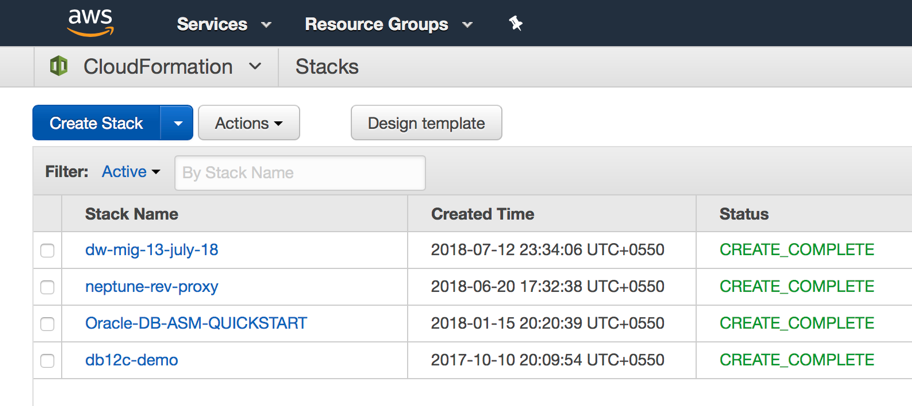
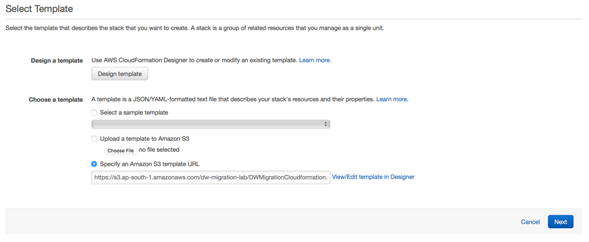
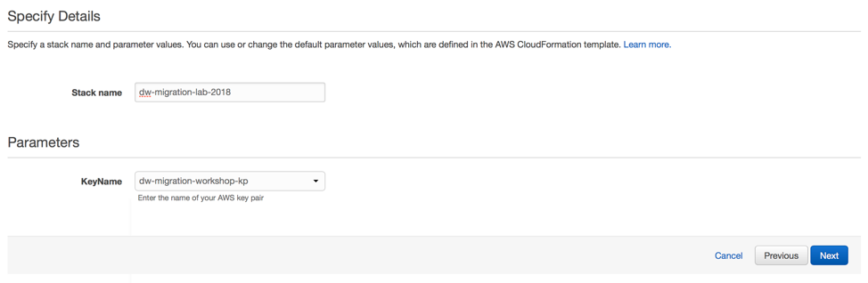

# Setting up the Infrastructure for the lab

In order to setup the infrastructure for this lab, we will be using an AWS CloudFormation template.

The CloudFormation template for this lab is available here: http://bit.ly/DWCFN

### **Important:**
Preferred regions for lab
- Singapore: AP-SOUTHEAST-1

The CloudFormation script can be launched only from Singapore region only and doesn't work on any other region.

## Creating the stack using the CloudFormation template

1. Login to the AWS Management Console and select CloudFormation under Management tools.

2. Once you are on the CloudFormation page, select the “Create Stack” option to create a new stack.

3. In the ‘choose a template section’, select “Specify an Amazon S3 Template URL” option and paste the URL of the CloudFormation template.

  NOTE: The CloudFormation template can only be launched in the ap-southeast-1 (Singapore) region.
  

4. Click Next. On the next page, provide the “Stack Name” and select an “EC2 Key Pair” available in the list.

  NOTE: This EC2 key pair is required to connect to the EC2 instances over SSH to install and configure the AWS SCT Extraction Agents.
  

5. On the next page,  it's optional step to enter Tag details to identify the resources provisioned by this CloudFormation template.

6. Click “Next”, check the acknowledgment box, and click on “Create” to launch the CloudFormation template.

  

7. You can observe the execution progress of CloudFormation as show below.
  

8.  Once the CloudFormation completes,  please look at the output tab in the CloudFormation console.
Here, you will find details of the various resources created such as the Amazon RDS instance, Amazon Redshift cluster, Amazon S3 bucket and the public IP of the Amazon EC2 instances on which the AWS SCT extraction agents will run.

This lab will conclude once the CloudFormation completes successfully and the user identifies the AWS resources properties in the output tab in CloudFormation Console.   Please proceed to the next lab.
