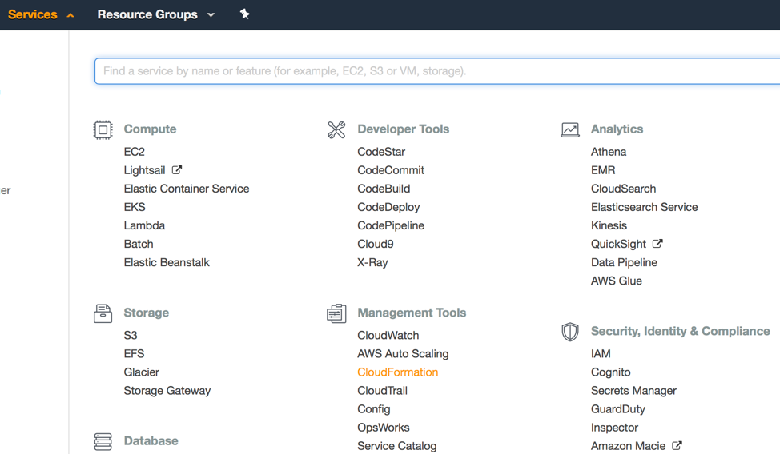
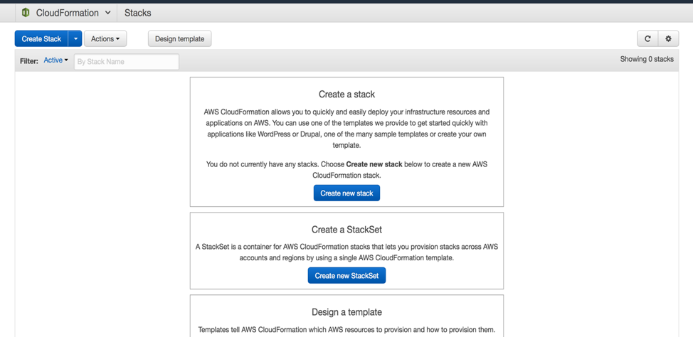
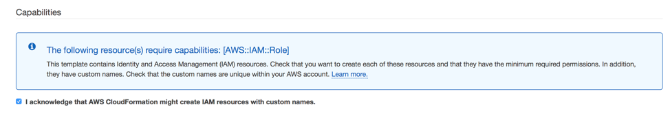
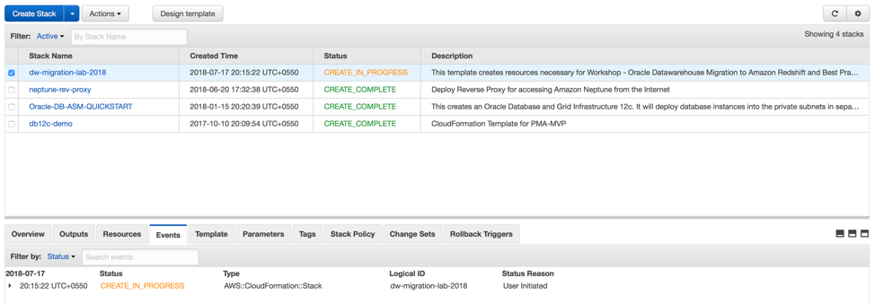

# Setting up the Infrastructure for the lab

In order to setup the infrastructure for this lab, we will be using an AWS CloudFormation template.

The CloudFormation template for this lab is available in the directory - cloudformation.

### **Important:**
**Note:** - This lab should be run in the Singapore region. Please make sure you select Singapore region : **ap-southeast-1**

The CloudFormation script can be launched only from Singapore region only and doesn't work on any other region.

## Creating the stack using the CloudFormation template

1. Login to the AWS Management Console and select CloudFormation under Management tools.  

    

2. Once you are on the CloudFormation page, select the “Create Stack” option to create a new stack.

       
     

3. Click Choose File and select Upload a template to Amazon S3 and Browse to where you downloaded the Zip file. Select the CloudFormation template called MigrationCloudFormation.json under the cloudformation directory and then click Next.   

       
   

4. Populate the form with the values specified below and then click Next.    

      > **Stack Name:**	Any name you would like to give the stack. but recommended name to be unique like DWMigration2019. Please append your initials if multiple people are running the lab in the same account.      

      > **KeyName:**	Select a key in Singapore region from the dropdown. If you created a key in step 1 then select that key or else select another key already existing in your account.  

 

5. On the Options page, put the following values for Tags and click Next.  All other values can remain as default.
    > Key = Environment   
    > Value = DWMigration2019

  

6. On the Review page, At the bottom of the screen please make sure you check the box ‘I acknowledge that AWS CloudFormation might create IAM resources with custom names.’ and Click Create.

  
 

7. You can observe the execution progress of CloudFormation as show below.
  
 

8. At this point, you will be directed back to the CloudFormation console and will see a status of CREATE_IN_PROGRESS.  Do not continue until the status changes to CREATE_COMPLETE.
 

9. Once CloudFormation has completed building the stack, the status will change to create_complete. Make sure to note the values for the following keys in the OUTPUTS tab. These will be needed as input for SCT and DMS setup.

  | Output Field Name | Description |
  | --- | --- |
  | Reinvent2018ANT371RedshiftEndpoint | End point for the Redshift cluster |
  | Reinvent2018ANT371VpcId | VPC ID of the newly created VPC |
  | Reinvent2018ANT371OracleEndpoint | End point of the source RDS database |
  | Reinvent2018ANT371SCTDNS | End point for the EC2 instance with SCT and drivers installed. |
  | Reinvent2018ANT371AGENT1PublicDNS | Public end point for first EC2 instance with SCT Extraction agent. |
  | Reinvent2018ANT371AGENT1PrivateIP | Private IP for first EC2 instance with SCT Extraction agent |
  | Reinvent2018ANT371AGENT2PublicDNS | End point for second EC2 instance with SCT Extraction agent. |
  | Reinvent2018ANT371AGENT2PrivateIP | VPrivate IP for second EC2 instance with SCT Extraction agent. |
  | Reinvent2018ANT371S3Bucket | S3 Bucket name. |
  | CredDatabaseDetails | Credentials for Oracle database and Amazon Redshift |
  | CredSCTDetails | Password for login to Windows SCT server. |

 

This lab will conclude once the CloudFormation completes successfully and the user identifies the AWS resources properties in the output tab in CloudFormation Console.   Please proceed to the next lab.
