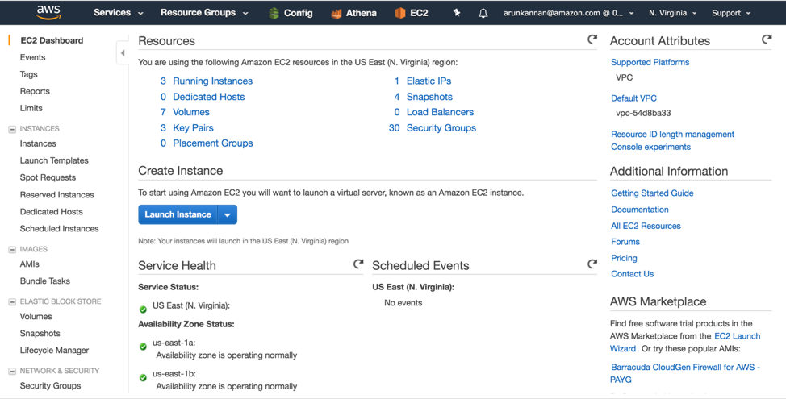
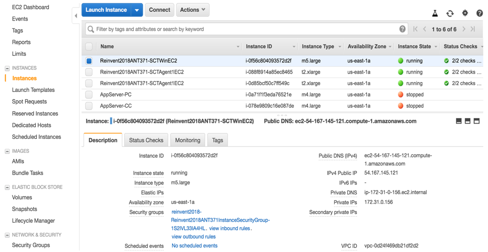
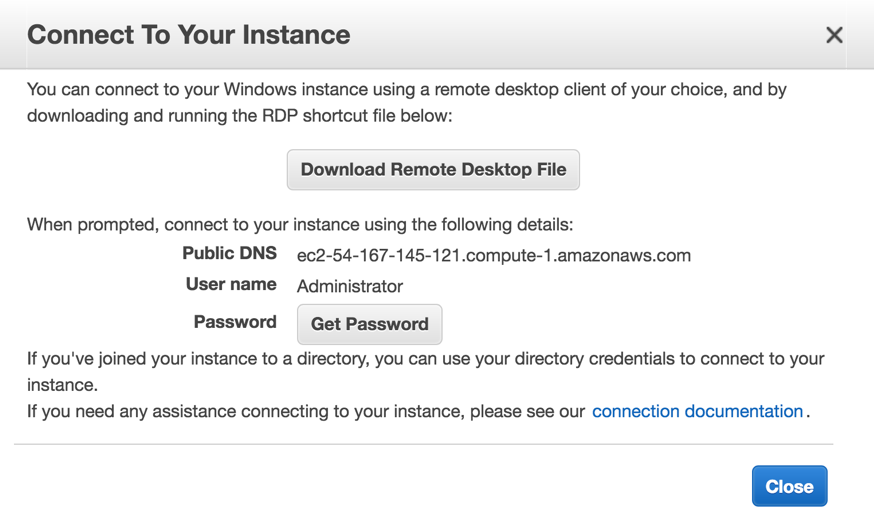
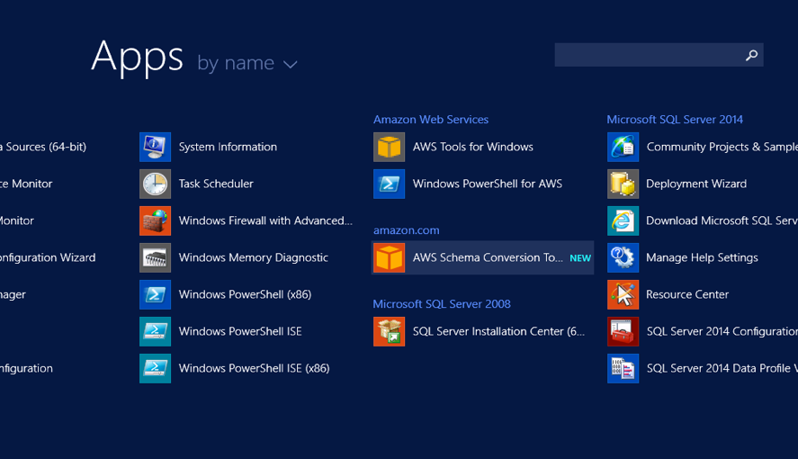
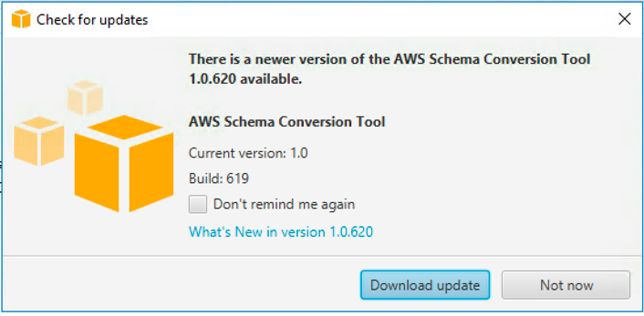
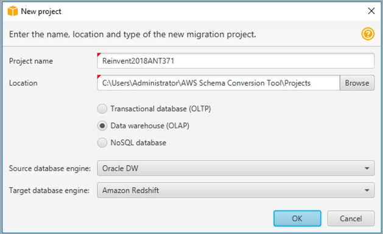
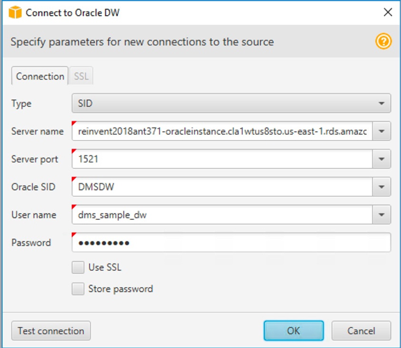
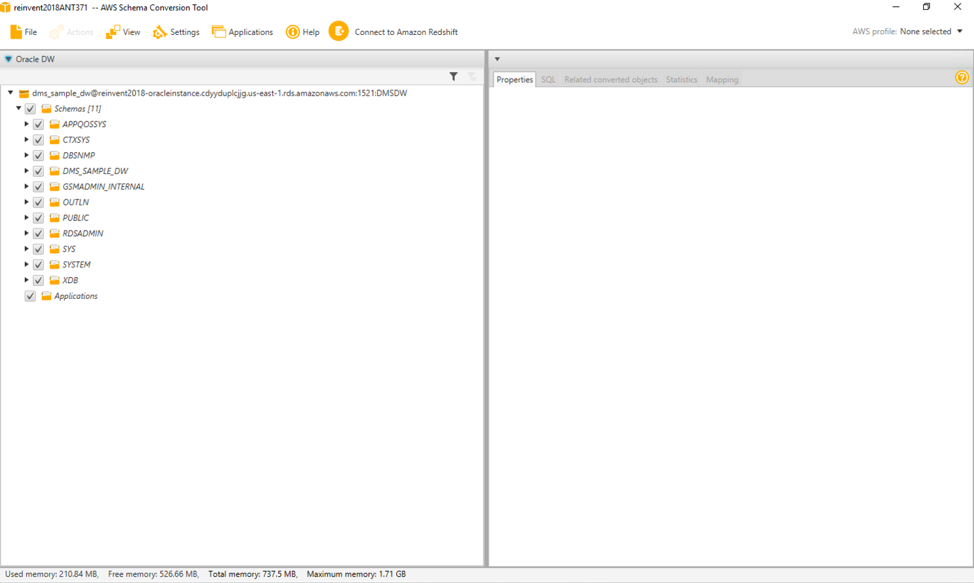

# Connect to your environment

Now that the environment has been built, the next step is to connect to the EC2 instance.

1.	Once CloudFormation has completed building the stack, go to the EC2 console located at: [link to AWS Management console ](https://console.aws.amazon.com/ec2/v2/home).  Then click Instances in the left column.

2.	Select the instance with Reinvent2018ANT371-SCTWinEC2  (or whatever name you gave your stack) in its name and obtain the Public IP Address from the instance.

3. Click on the Connect button to popup the window as shown below and click on Download Remote Desktop File button to download the RDP file. (Note that you do not need to use the ‘Get Password’ button for this lab. The password is provided in step 4.)

4.	Using the RDP tool in Mac/Windows, open the RDP file downloaded. Use the username ‘Administrator’ if it’s blank and the password as “DWMigration@1”.

## Install AWS schema Conversion Tool and verify connectivity to Oracle RDS and Amazon Redshift from AWS SCT

1.	Once connected launch SCT installation msi from the ANT371 folder on the desktop of the EC2 instance. You will find it under the ANT371 folder as ‘AWS Schema Conversion Tool-1.0.619.msi’. Double click it to launch Schema Conversion Tool installation.

2. After clicking AWS Schema Conversion Tool, wait for a minute for the tool to launch, hit Run and install AWS Schema Conversion Tool. Once installed, be aware there will be no confirmation message of the installation. Click on Windows Start button, and click on Down Arrow to list Apps, drag the bar to the right until you see AWS Schema Conversion Tool as seen below:

3.	Click on Schema Conversion Tool to open the application.  You may see a message that asks to download new version, click Not now button and proceed. If you do upgrade then your screen shots may vary from what we have in the lab document.

4.	A New Database Migration Project page opens. If a new project does not open then click on ** File ** and ** New Project.**  Provide a Project Name of your choice (recommended ** Reinvent2018ANT371 **) and leave Location default.  Make sure you select ** Data Warehouse (OLAP) ** and Source Database Engine as ** Oracle DW **  and the Target Database Engine as ** Amazon Redshift.**  Click OK.

5.	Click on Connect to Oracle DW on the top menu and put in the following details and click Test Connection. It should come back with a message ‘Connection successful’. Then click OK. Update screen shot

Type | SID
---- | ----
Server name | Take this from the output of the CloudFormation template in Step 8. It is the Reinvent2018ANT371OracleEndpoint output field.
Server port | 1521
Oracle SID | DMSDW
User name | dms_sample_dw
Password | Password1
Oracle Driver Path | Specify the Oracle driver path as C:\Users\Administrator\Desktop\ANT371\OracleDrivers\ojdbc7.jar

6.	Now you should see the Oracle DW schema on your left as shown below.

7.	Click on the Connect to Amazon Redshift on the top menu and put in the following details anc click Test Connection. It should come back with a message ‘Connection successful’. Then click OK.

Type | SID
---- | ----
Server name | Take this from the output of the CloudFormation template in Step 8. It is the Reinvent2018-ANT371-Redshift-Endpoint output field.
Server port | 5439
Database | dmsdwtarget
User name | dms_sample_dw
Password | Password1
Amazon Redshift Driver Path | C:\Users\Administrator\Desktop\ANT371\RedshiftDrivers\RedshiftJDBC42-1.2.16.1027.jar

## Use AWS SCT to convert schema from source Oracle to target Amazon Redshift
