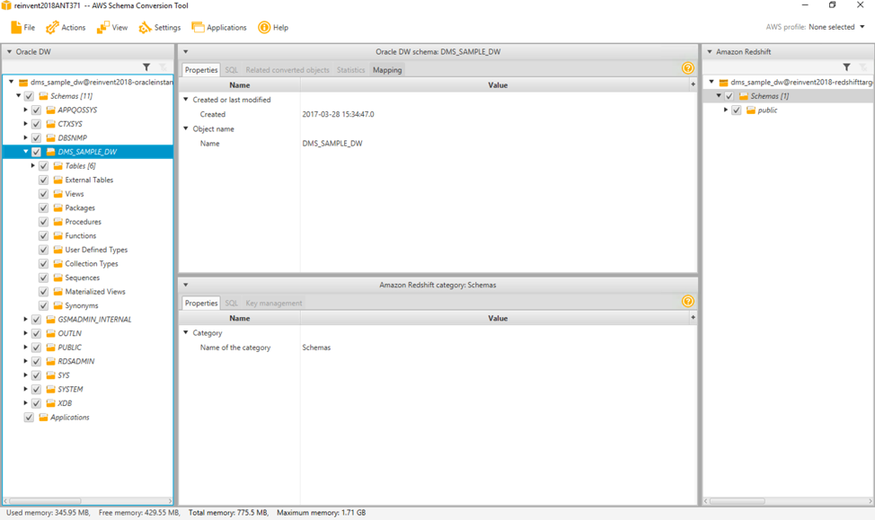
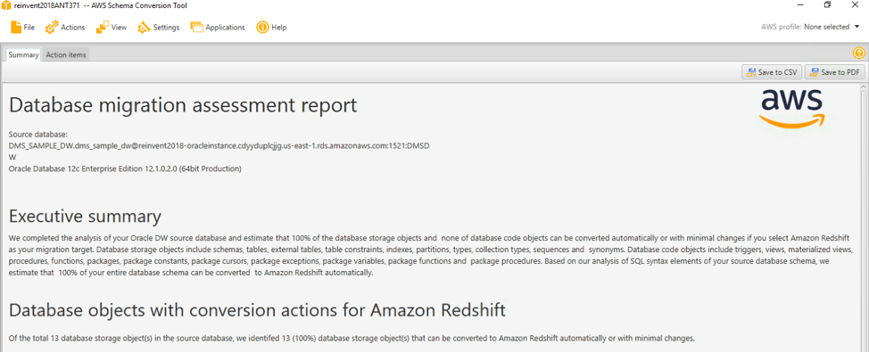
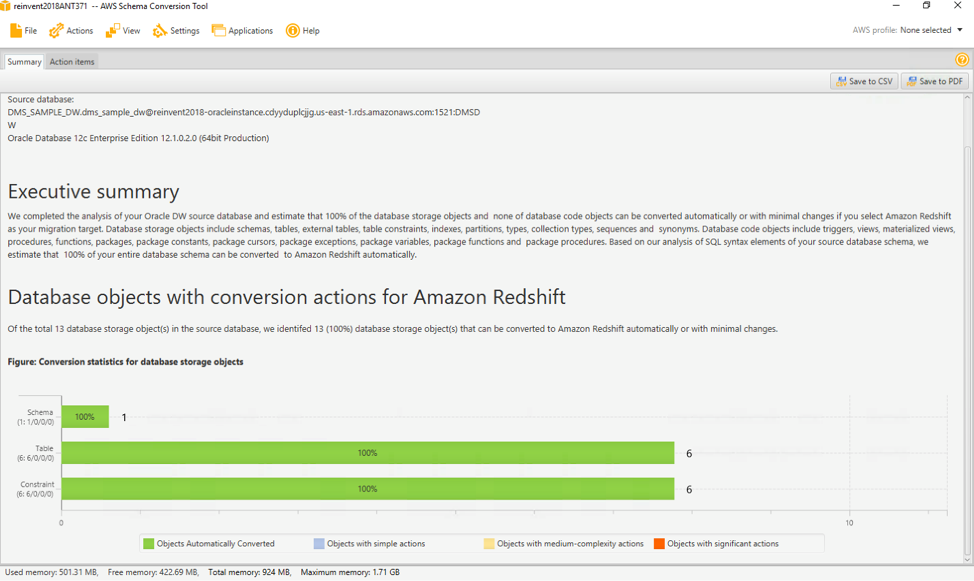
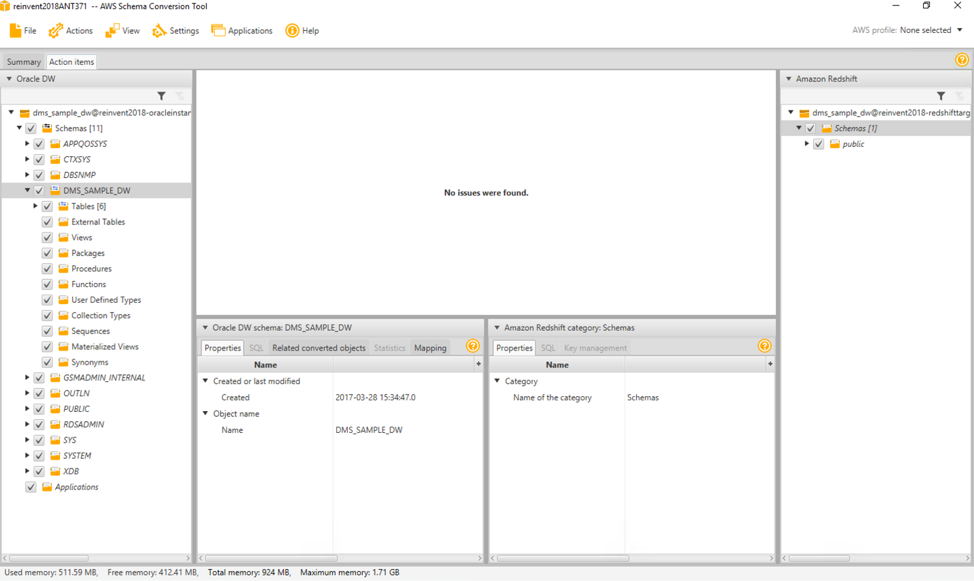
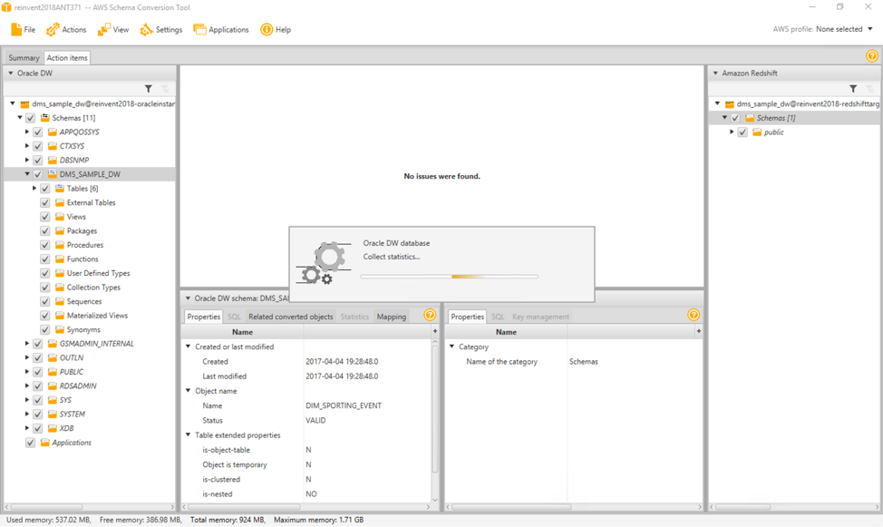
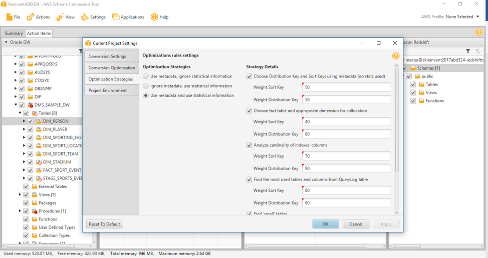
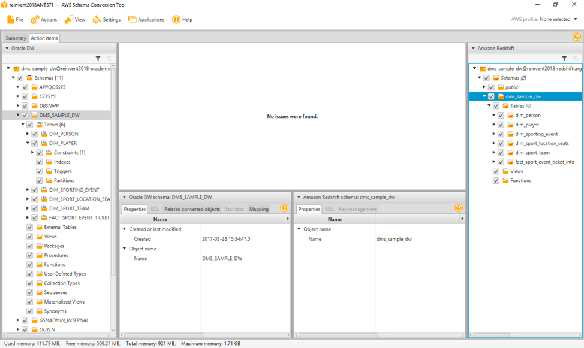
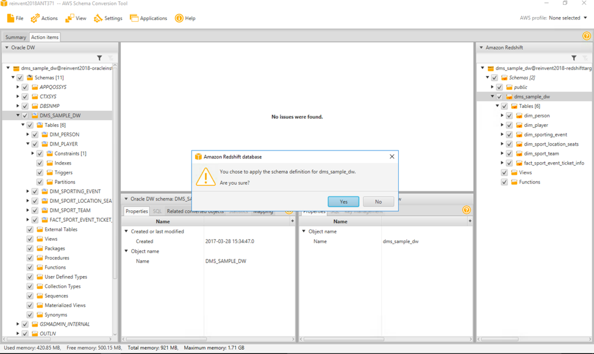

# Use AWS SCT to convert schema from source Oracle to target Amazon Redshift

1. Now you should see Redshift on the right hand side. Click on the dms_sample_dw schema on the left hand side in the Oracle DW. You may see a message saying loading metadata. Once that is done your screen should look like below.

  

2. Right click on the dms_sample_dw schema in the left pane and click Create Report. This will create an assessement report.

  You will get a message saying that ‘Your Optimization Settings require run-time statitics information from the source database. Would you like to load statistics?’ Click Continue. This will take about 30-40 secs and your Database Migration Assessement Report will be ready.

  The AWS SCT creates a database migration assessment report to help you convert your schema. The database migration assessment report provides important information about the conversion of the schema from your source database to your target database instance. The report summarizes all of the schema conversion tasks and details the action items for schema that can't be converted to the DB engine of your target DB instance. The report also includes estimates of the amount of effort that it will take to write the equivalent code in your target DB instance that can't be converted automatically.

  
   

  

3. Choose the Action Items tab. This tab will show all the items that need to be fixed before they can be migrated. E.g. data types that mismatch, objects not supported by Redshift like stored procedures, materialised views etc.

  

  Some of the few issues depending on the source schema, which our customers may encountered during the schema conversion .

  **Unable to convert datatypes** – This is for an CLOB datatype which is converted to VARCHAR. For a list of target data types see [here](http://docs.aws.amazon.com/dms/latest/userguide/CHAP_Reference.Target.Redshift.DataTypes.html). SCT also specifies using S3 as storage for this datatype.

  **Amazon redshift supports stored procedures** – The existing stored procedure  will need to be manually converted or rewritten per Amazon Redshift standards.

  **Amazon Redshift doesn’t support sequences**  – This will need to be manually converted. All the materialised views need to be converted to tables in Redshift and data loading scripts need to be defined separately to populate them.

  In a real life scenario you will need to work through these issues and resolve them before moving on.

4. Open the context (right-click) menu for the dms_sample_dw item in the Schemas list in the Oracle DW pane on the left, and then choose Collect Statistics. AWS SCT analyzes the source data to recommend the best keys for the target Amazon Redshift database. For more information, see [Collecting or Uploading Statistics for the AWS Schema Conversion Tool](http://docs.aws.amazon.com/dms/latest/userguide/CHAP_SchemaConversionTool.DW.Statistics.html).  

  

5. To optimise how the AWS Schema Conversion Tool (AWS SCT) converts your data warehouse schema, you can choose the strategies and rules you want the tool to use. After converting your schema, and reviewing the suggested keys, you can adjust your rules or change your strategy to get the results you want. Choose Settings, and then choose Project Settings. The Current project settings dialog box appears. In the left pane, choose optimisation Strategies. The optimisation strategies appear in the right pane with the defaults selected. For optimisation Strategies, choose the optimisation strategy you want to use.

  You can choose from the following:
    * Use metadata, ignore statistical information
    * Ignore metadata, use statistical information
    *	Use metadata and use statistical information  

  After you choose your optimisation strategy, you can choose the rules you want to use and provide weights to each. You can choose from the following:
      * Choose Distribution Key and Sort Keys using metadata
      * Choose fact table and appropriate dimension for collation
      * Analyse cardinality of indexes' columns
      * Find the most used tables and columns from QueryLog table

For the purposes of this lab we will not change any settings and use the default.

  

6.	In the Oracle DW view open the context (right-click) menu for the dms_sample_dw schema, and then choose Convert schema. Choose Yes for the confirmation message. AWS SCT then converts your schema to the target database format.

  

7.	In the Amazon Redshift view, open the context (right-click) menu for the dms_sample_dw schema, and then choose Apply to database to apply the schema scripts to the target Amazon Redshift instance.

  When complete, open the context (right-click) menu for the dms_sample_dw schema, and then choose Refresh from Database to refresh from the target database. Click Yes to confirm. The database schema has now been converted and imported from source to target.

  
