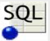
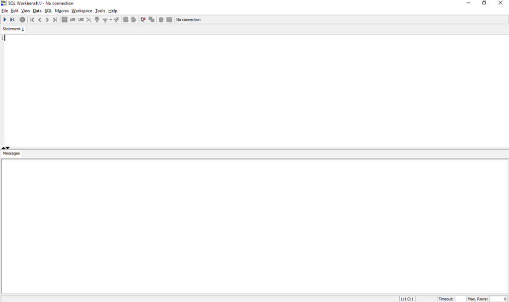
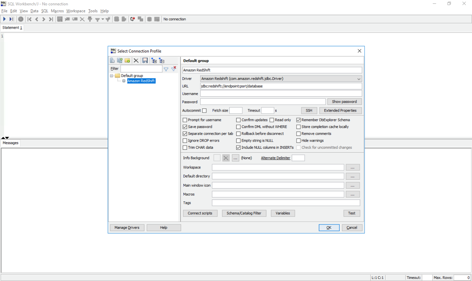
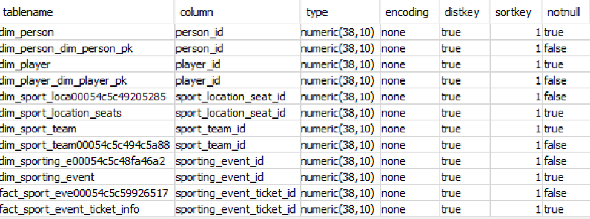

# Validate the schema conversion and work through conversion issues

1.	To validate the schema conversion, you compare the objects found in the Oracle and Amazon Redshift databases using SQL Workbench/J.  

  Double click the SQL Workbench shortcut   in the desktop folder on your EC2 instance.  

  

2.	Click on File, Connect Window and a Select Connection Profile screen will pop up.

  

3.	Create two connections, OracleDW and RedshiftDW with the following information.

Name | OracleDW
---- | ----
Driver | Choose the Oracle driver which is installed on your EC2 instance. You can specify the drivers path by clicking on Manage Drivers and pointing the path to C:\Users\Administrator\Desktop\ANT371\OracleDrivers\ojdbc7.jar .
URL | Jdbc url as follows - jdbc:oracle:thin:@OracleEndpoint:1521:DMSDW Get the Reinvent2018ANT371OracleEndpoint from step 8
User name | dms_sample_dw
Password | Password1

  Check AutoCommit and click OK. OracleDW will connect to the Source Oracle database.

4. The RedshiftDW will connect to the target Redshift cluster.

Name | RedshiftDW
---- | ----
Driver | Choose the Redshift driver which is installed on your EC2 instance. You can specify the drivers path by clicking on Manage Drivers Drivers and pointing the path to C:\Users\Administrator\Desktop\ANT371\RedshiftDrivers\ RedshiftJDBC42-1.2.16.1027.jar .
URL | Jdbc url can be found on Redshift cluster page on the AWS Management Console. Its format is as follows: jdbc:redshift://Redshift Endpoint:5439/dmsdwtarget
User name | dms_sample_dw
Password | Password1

5.	 In SQL Workbench/J, choose File, then choose Connect window. Choose the RedshiftConnection you created in an earlier step. Choose OK.  

6.	Run the following script to verify the number of object types and count in dms_sample_dw schema in the target Amazon Redshift database. These values should match the number of objects in the source Oracle database.

  ```
  SELECT 'TABLE' AS OBJECT_TYPE,
         TABLE_NAME AS OBJECT_NAME,
         TABLE_SCHEMA AS OBJECT_SCHEMA
  FROM information_schema.TABLES
  WHERE TABLE_TYPE = 'BASE TABLE'
  AND   OBJECT_SCHEMA = 'dms_sample_dw'
  ```
The output from this query should be similar to the following.


7.	Verify the sort and distributions keys that are created in the Amazon Redshift cluster by using the following query.
```
SET search_path TO '$user', 'public',  'dms_sample_dw';
SELECT tablename,
       "column",
       TYPE,
       encoding,
       distkey,
       sortkey,
       "notnull"
FROM pg_table_def
WHERE (distkey = TRUE OR sortkey <> 0);
```
The results of the query reflect the distribution key (distkey) and sort key (sortkey) choices made by using AWS SCT key management.

