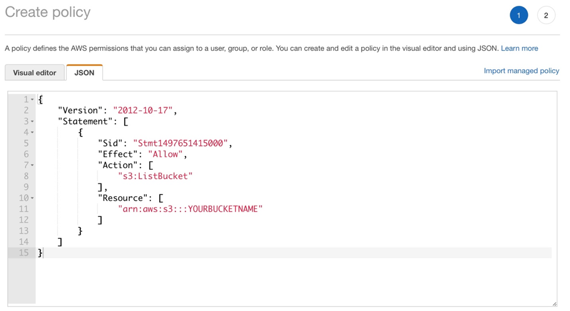
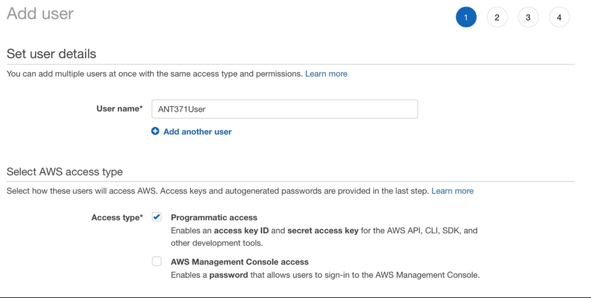
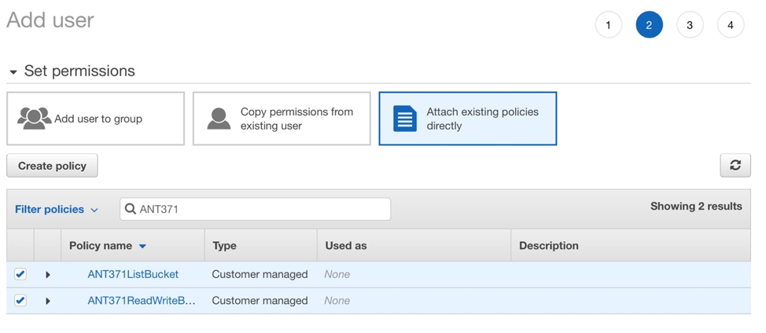
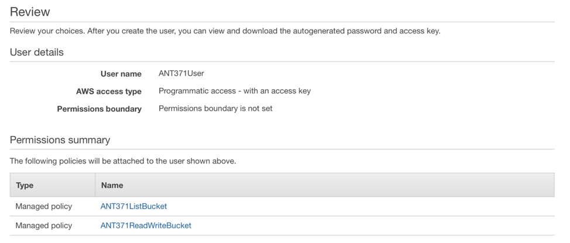
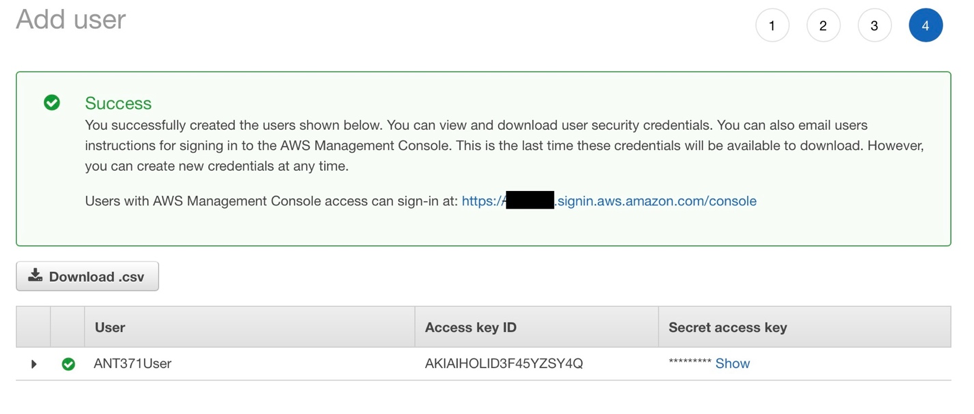
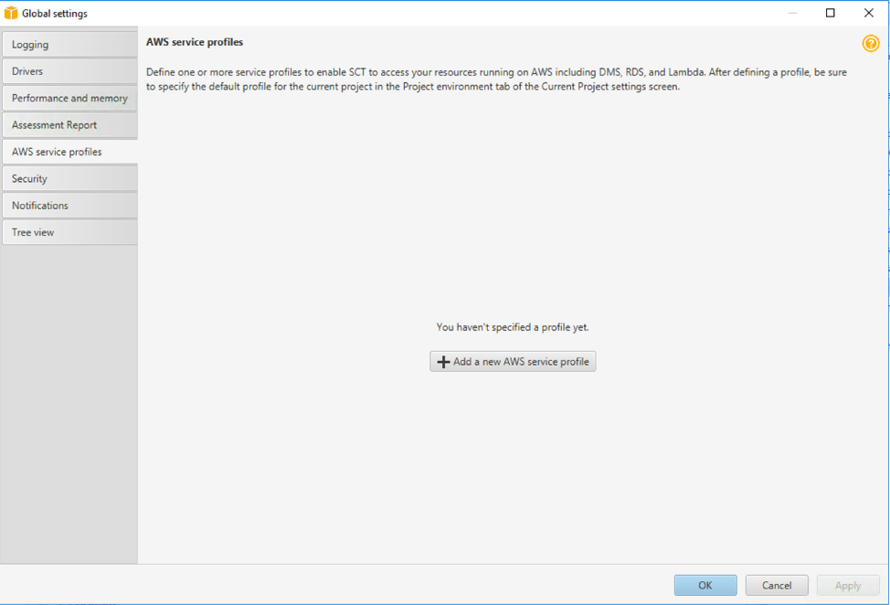
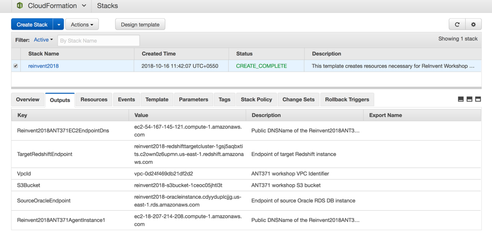
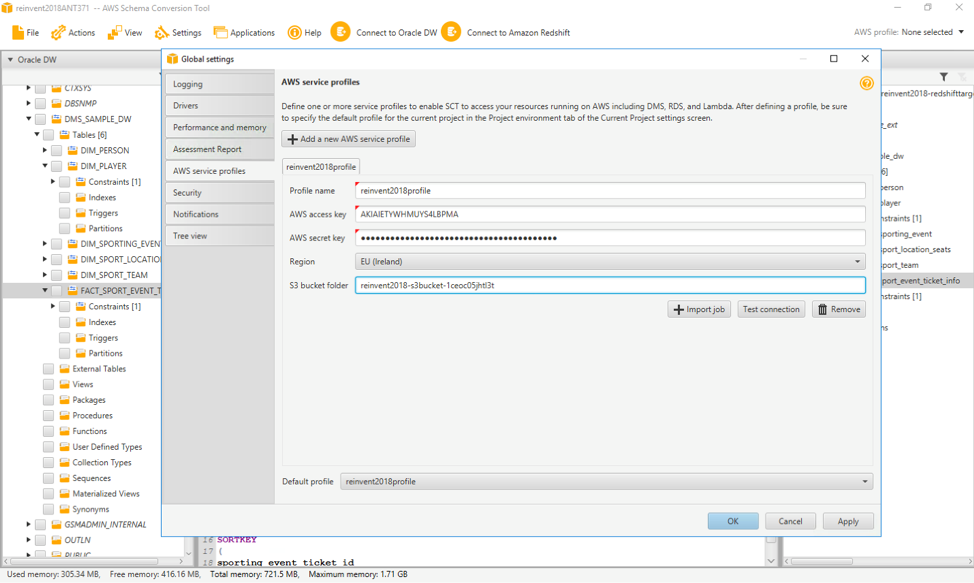

# Configuring SCT for AWS data extraction agents

## Create IAM Access Key and Access Secret Key for SCT Authentication

SCT requires IAM Access Key and Access Secret Key for authentication. Best practice is to create a minimum privilege IAM user for this purpose, which you can later delete.

You will start with creating two IAM policies.  One which will allow SCT to list your bucket for the lab, and the other to Delete, Put, and Get objects in the bucket.  Next you will create a new IAM user, attach these two policies to the user, then save the Access Key and Access Secret Key to be used in SCT.

  1.	Select IAM in the AWS Console. Select Policies and Create Policy.

  2.	In the Create policy page, select JSON, and copy/paste the following policy.  Ensure to replace ** <<YOURBUCKETNAME>> ** with the S3 Bucket name created in CloudFormation.  Select Review Policy.

  >
    ```
    {
        "Version": "2012-10-17",
        "Statement": [
            {
                "Sid": "Stmt1497651415000",
                "Effect": "Allow",
                "Action": [
                    "s3:ListBucket"
                ],
                "Resource": [
                    "arn:aws:s3:::<<YOURBUCKETNAME>>"
                ]
            }
        ]
    }
    ```
    <br/>

    >  

  3.	In the Review Policy page, provide a policy name, such as ANT371ListBucket and select Create Policy.

  4.	You will return to the IAM Policies page.  You need to create one more policy.  Select Create Policy, select the JSON tab, and use the following policy. Ensure to replace ** <<YOURBUCKETNAME>> ** with the S3 Bucket name created in CloudFormation.  Select Review Policy.

  >
      ```
      {
      "Version": "2012-10-17",
      "Statement": [
          {
              "Sid": "Stmt1497631447000",
              "Effect": "Allow",
              "Action": [
                  "s3:DeleteObject",
                  "s3:GetObject",
                  "s3:PutObject"
              ],
              "Resource": [
                  "arn:aws:s3:::YOURBUCKETNAME/*"
              ]
          }
      ]
  }
  ```
<br/>

  5.	In the Review Policy page, provide a policy name, such as ANT371ReadWriteBucket and select Create Policy.

  6.	You now need to create an IAM user. In IAM, go to Users and select Add User.

  7.	In the Add user page, provide a name, such as ANT371User, and select the Programmatic Access checkbox. Select Next.

  >  

  8.	In the Set permissions page, select Attach existing policies directly.  In the Filter policies field, enter ANT371. You should see both policies created.  Select both and select Next.

  > 


  9.	In the Review screen select Create User.

  > 

  10.	The final screen shows the IAM Access key and Secret access key.  Select Show to view the secret key.

####  Ensure you save these credentials for SCT. Once you select close the Secret key will no longer be available.

  > 

## AWS SCT Global Settings and Amazon S3 Bucket Configuration

#### Steps to Create a Global Profile:

  1.	Click on ‘Settings’ -> ‘Global Settings’ and then select ‘AWS Service Profiles’.

    > 

    2.	Click on “Add a new AWS Service Profile”

    3.	Enter details such as Profile Name, AWS Access Key and AWS Secret Key

    > **NOTE:** You will need an AWS Access Key and AWS Secret Access key in AWS IAM for connecting to the AWS Services.  For instructions to create the appropriate policies and user, go to Appendix A at the end of the lab

    4.	Select the region that’s applicable or selected during the execution of CloudFormation script, for example:  we suggested to use **Singapore** as your region.

    5.	For the “S3 bucket folder”, use the “Reinvent2018ANT371S3Bucket” name from the output tab of the CloudFormation console.

    > 

    6.	The AWS profile screen with your inputs provided should look similar to the screenshot given below:

    > 

    7.	Click Apply button to save the profile and click OK.
