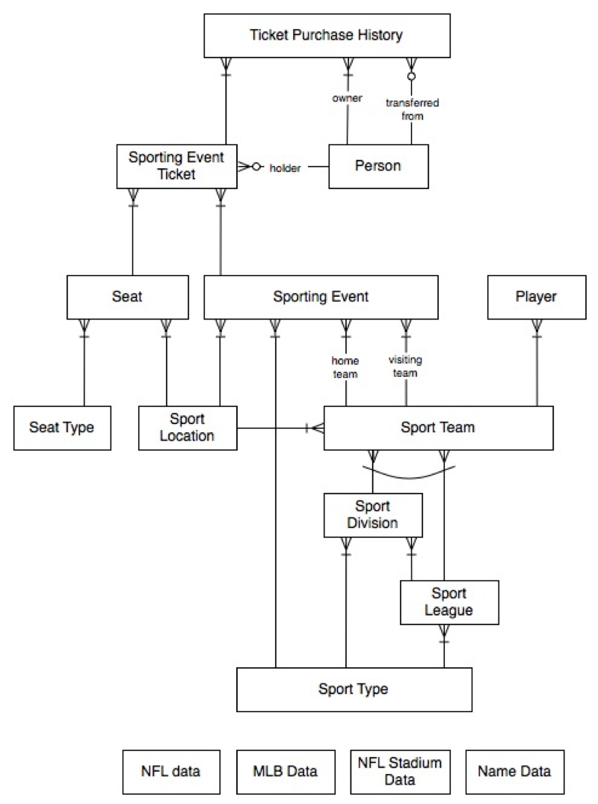

Last Updated - Nov-2020

## Data Warehouse Migration to Amazon Redshift

In few hours, quickly learn how to effectively migrate an existing oracle data warehouse workload to Amazon Redshift using AWS Schema Conversion Tool (SCT) and SCT data extractors.   In this session, we will demonstrate the detailed  approach and embrace some of the advance features and best practices around various AWS services like AWS Schema Conversion Tool (SCT) ,  SCT data extractors agents  and Amazon Redshift.   

See the diagram below for a depiction of the complete architecture.

As shown in the diagram above, multiple SCT extraction agents extract your data from the source data warehouse and upload it to Amazon S3 in parallel. Then, you can use AWS SCT to copy the data automatically to Amazon Redshift, or you can manually load the data from Amazon S3 into Amazon Redshift at a later point in time.

## Prerequisites

Pre-requisites to be completed before creating the stack

a.	**Amazon EC2 Key Pair** - The CloudFormation template requires an Amazon EC2 Key Pair as an input. This key pair is required to access the EC2 instances on which the SCT extraction agents will run. If you do not have an existing key pair in the region, please create one before launching the CloudFormation template.

**Note: - This lab should be run in the Singapore region. Please make sure you select Singapore region before you go to the next steps outlined below.**

If you do not have a key in the Singapore region, please follow these steps

1. Open the AWS Management console at https://console.aws.amazon.com/ec2/v2/home

2. Change the Region to Singapore.

3. Click on Key Pairs on the left hand menu and then click on Create Key Pair.   Give your key pair a name e.g. Works371 and click Create. A dialog box will open asking you to save the key file. Click on Save File to save the key. Remember where you saved the key or move it to another folder of your choice. You will need this later.

b. **IAM Permissions** – You need IAM permissions to create resources such as Amazon VPC, Amazon Redshift cluster, Amazon RDS instances, Amazon EC2 instances and Amazon S3 buckets.

c.	**AWS Limits** - Ensure that you will not exceed the number of EC2 instances allowed by default in a given region (CloudFormation will create three EC2 instances). Ensure that you will not exceed number of VPCs allowed by default in a given region (CloudFormation will create one new VPC).

# Verify the Source Data Warehouse before Migration

For the purpose of this workshop, we have used an Amazon RDS for Oracle instance to host the Oracle Data Warehouse. In a real-life situation, this Oracle data warehouse could be on-premises, on Amazon EC2 or on Amazon RDS itself.

Once the CloudFormation Stack is created, an Amazon RDS instance will be provisioned along with the proper security group, DB instance type, storage type configuration and size as specified in the CloudFormation template.

**NOTE:** To keep things simple for this lab, we have kept most of the configuration static in the CloudFormation template.

This Amazon RDS instance is pre-loaded with a sample schema (dms_sample). The sample schema mimics a simple sporting event ticketing application. The following diagram illustrates the data model we will be working in the lab.

# Labs
This workshop is broken into multiple labs. You must complete each Lab before proceeding to the next.

1. [Lab 1 - Setting up the Lab](Lab-Part1.md)

2. [Lab 2 - Connect to your environment](Lab-Part2.md)

3. [Lab 3 - Using AWS SCT to convert the Schema](Lab-Part3.md)

4. [Lab 4 - Validate the Converted Schema](Lab-Part4.md)

5. [Lab 5 - Configuring SCT for AWS data extraction agents](Lab-Part5.md)

6. [Lab 6 - Working with AWS SCT Extraction Agents](Lab-Part6.md)

7. [Lab 7 - Conclusion](Lab-Part7.md)

## License Summary

This sample code is made available under a modified MIT license. See the LICENSE file.
