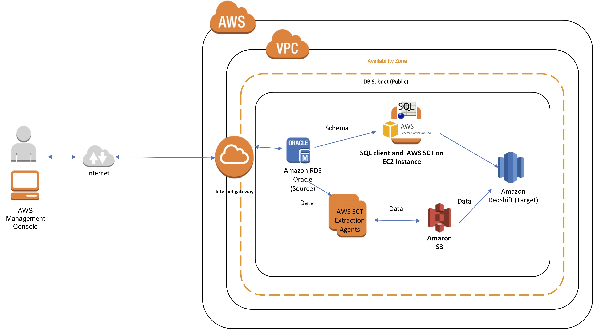

## Data Warehouse Migration to Amazon Redshift

In few hours, quickly learn how to effectively migrate an existing oracle data warehouse workload to Amazon Redshift using AWS Schema Conversion Tool (SCT) and SCT data extractors.   In this session, we will demonstrate the detailed  approach and embrace some of the advance features and best practices around various AWS services like AWS Schema Conversion Tool (SCT) ,  SCT data extractors agents  and Amazon Redshift.   

See the diagram below for a depiction of the complete architecture.

As shown in the diagram above, multiple SCT extraction agents extract your data from the source data warehouse and upload it to Amazon S3 in parallel. Then, you can use AWS SCT to copy the data automatically to Amazon Redshift, or you can manually load the data from Amazon S3 into Amazon Redshift at a later point in time.

## Prerequisites

Pre-requisites to be completed before creating the stack

a.	Amazon EC2 Key Pair - The CloudFormation template requires an Amazon EC2 Key Pair as an input. This key pair is required to access the EC2 instances on which the SCT extraction agents will run. If you do not have an existing key pair in the region, please create one before launching the CloudFormation template.
b. IAM Permissions – You need IAM permissions to create resources such as Amazon VPC, Amazon Redshift cluster, Amazon RDS instances, Amazon EC2 instances and Amazon S3 buckets.
c.	AWS Limits - Ensure that you will not exceed the number of EC2 instances allowed by default in a given region (CloudFormation will create three EC2 instances). Ensure that you will not exceed number of VPCs allowed by default in a given region (CloudFormation will create one new VPC).

# Labs
This workshop is broken into multiple labs. You must complete each Lab before proceeding to the next.

1. [Lab 1 - Setting up the Lab](Lab-Part1.md)

2. [Lab 2 - Running the Lab](Lab-Part2.md)

## License Summary

This sample code is made available under a modified MIT license. See the LICENSE file.
